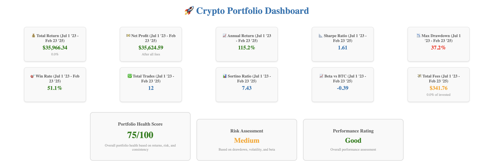
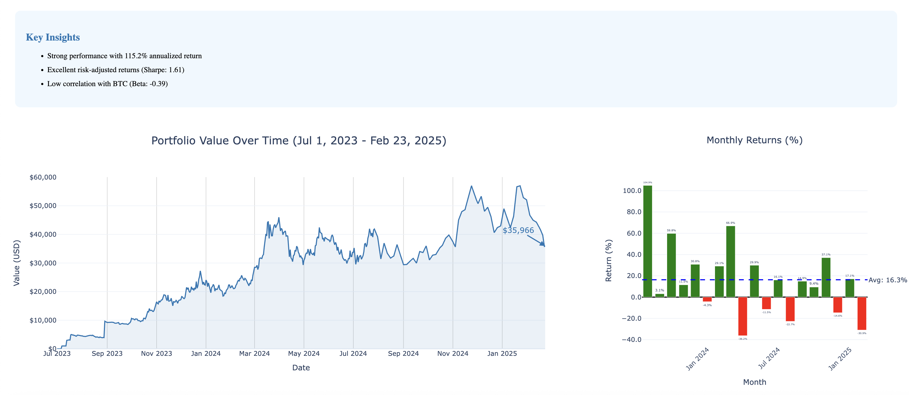

# Crypto Portfolio Performance Tracker

[](https://www.python.org/downloads/)
[](https://opensource.org/licenses/MIT)
[](https://github.com/psf/black)

A professional-grade cryptocurrency portfolio tracking system with advanced analytics, cost basis tracking, and comprehensive performance metrics.



## 🚀 Features

- **📊 Complete Transaction Processing**: Handles buys, sells, deposits, withdrawals, conversions, and more
- **💰 Advanced Cost Basis Tracking**: FIFO, LIFO, and HIFO accounting methods
- **📈 Professional Metrics**: Sharpe ratio, Sortino ratio, Calmar ratio, maximum drawdown, and more
- **🔄 Real-time Price Updates**: Integrated with cryptocurrency price APIs
- **🎨 Interactive Dashboard**: Beautiful dark-themed Plotly Dash interface
- **📱 Tax Reporting**: Generate capital gains reports for tax purposes
- **🔍 Position Analysis**: Detailed tracking of individual positions with P&L
- **📉 Rolling Window Analysis**: Track performance metrics over time

## 📸 Screenshots

<details>
<summary>View Dashboard Screenshots</summary>

### Main Dashboard


### Performance Metrics


</details>

## 🏗️ Architecture

The project follows **Clean Architecture** principles with clear separation of concerns:

```
src/
├── core/           # Domain entities and business logic
├── application/    # Use cases and services
├── infrastructure/ # External integrations
└── presentation/   # UI (Dashboard & CLI)
```

See [architecture.md](docs/architecture.md) for detailed information.

## 🚦 Quick Start

### Prerequisites

- Python 3.8 or higher
- 4GB RAM (8GB recommended)
- 500MB free disk space

### Installation

```bash
# 1. Clone the repository
git clone https://github.com/yourusername/crypto-portfolio-tracker.git
cd crypto-portfolio-tracker

# 2. Create virtual environment
python -m venv venv
source venv/bin/activate  # On Windows: venv\Scripts\activate

# 3. Install dependencies
make install  # Or: pip install -r requirements.txt

# 4. Set up the project
make setup  # Or: python quick_start.py

# 5. Place your CSV file
cp /path/to/your/transactions.csv "data/raw/portfolio_transactions copy.csv"

# 6. Initialize and run
make init
make run
```

Open your browser and navigate to http://localhost:8050

## 📋 CSV Format

Your transaction CSV should have these columns:

| Column | Required | Example |
|--------|----------|---------|
| timestamp | Yes | 2024-01-15 14:30:00 |
| type | Yes | Buy, Sell, Deposit |
| asset | Yes | BTC, ETH, USD |
| amount | Yes | 0.5 |
| price_usd | No* | 45000.00 |
| total_usd | No* | 22500.00 |
| fee_usd | No | 10.00 |
| exchange | No | Coinbase |

*Either price_usd or total_usd required for trades

## 🖥️ Usage

### Dashboard (Default)

```bash
make run  # Or: python main.py
```

### Command Line Interface

```bash
# Show portfolio status
make status

# Update prices
make update

# Generate tax report
make tax-report

# Create backup
make backup

# See all commands
make help
```

### Docker

```bash
# Using docker-compose (recommended)
docker-compose up -d

# Or build and run manually
make docker-build
make docker-run
```

## 📊 Metrics Explained

- **Sharpe Ratio**: Risk-adjusted returns (>1 is good, >2 is excellent)
- **Sortino Ratio**: Downside risk-adjusted returns
- **Max Drawdown**: Largest peak-to-trough decline
- **Win Rate**: Percentage of profitable trades
- **Calmar Ratio**: Annual return divided by max drawdown

## 🧪 Development

### Setup Development Environment

```bash
# Install dev dependencies
make install-dev

# Run tests
make test

# Run linting
make lint

# Format code
make format

# Type checking
make type-check
```

### Project Structure

```
crypto-portfolio-tracker/
├── src/              # Source code
├── tests/            # Test files
├── data/             # Data storage
│   ├── raw/         # Input CSV files
│   ├── processed/   # Processed data
│   └── cache/       # Cached prices
├── docs/            # Documentation
├── scripts/         # Utility scripts
├── Makefile         # Build automation
└── main.py          # Entry point
```

## 🔧 Configuration

Create a `.env` file for custom settings:

```env
# Portfolio Settings
PORTFOLIO_NAME=My Crypto Portfolio
COST_BASIS_METHOD=FIFO
RISK_FREE_RATE=0.02

# Dashboard Settings
DASHBOARD_PORT=8050
DASHBOARD_DEBUG=False

# API Settings (optional)
COINGECKO_API_KEY=your_api_key
```

## 📚 Documentation

- [Setup Guide](docs/setup.md) - Detailed installation instructions
- [Architecture](docs/architecture.md) - System design and patterns
- [API Reference](docs/api.md) - Code documentation
- [Contributing](CONTRIBUTING.md) - How to contribute

## 🤝 Contributing

Contributions are welcome! Please read our [Contributing Guide](CONTRIBUTING.md) for details on our code of conduct and the process for submitting pull requests.

### Development Workflow

1. Fork the repository
2. Create your feature branch (`git checkout -b feature/AmazingFeature`)
3. Commit your changes (`git commit -m 'Add some AmazingFeature'`)
4. Push to the branch (`git push origin feature/AmazingFeature`)
5. Open a Pull Request

## 🐛 Troubleshooting

### Common Issues

<details>
<summary>Import errors</summary>

Run from the project root directory:
```bash
cd /path/to/crypto-portfolio-tracker
python main.py
```
</details>

<details>
<summary>CSV file not found</summary>

Ensure your file is at: `data/raw/portfolio_transactions copy.csv`
</details>

<details>
<summary>Price fetch failures</summary>

- Check internet connection
- Wait 1-2 minutes (rate limits)
- API key may be required for high frequency
</details>

See [Troubleshooting Guide](docs/troubleshooting.md) for more solutions.

## 📈 Roadmap

- [ ] Multi-portfolio support
- [ ] Real-time WebSocket price updates
- [ ] Mobile app
- [ ] DeFi integration
- [ ] Advanced tax strategies
- [ ] Machine learning predictions
- [ ] Social features

## 📄 License

This project is licensed under the MIT License - see the [LICENSE](LICENSE) file for details.

## 🙏 Acknowledgments

- Built with [Plotly Dash](https://plotly.com/dash/) for visualizations
- Uses [CoinGecko API](https://www.coingecko.com/api) for price data
- Inspired by professional trading platforms

## 💬 Support

- 📧 Email: support@example.com
- 💬 Discord: [Join our community](https://discord.gg/example)
- 🐛 Issues: [GitHub Issues](https://github.com/yourusername/crypto-portfolio-tracker/issues)

## ⭐ Star History

[](https://star-history.com/#yourusername/crypto-portfolio-tracker&Date)

---

<p align="center">
  Made with ❤️ by crypto enthusiasts, for crypto enthusiasts
</p>

<p align="center">
  <a href="#-features">Features</a> •
  <a href="#-quick-start">Quick Start</a> •
  <a href="#-usage">Usage</a> •
  <a href="#-documentation">Docs</a> •
  <a href="#-contributing">Contributing</a>
</p>
